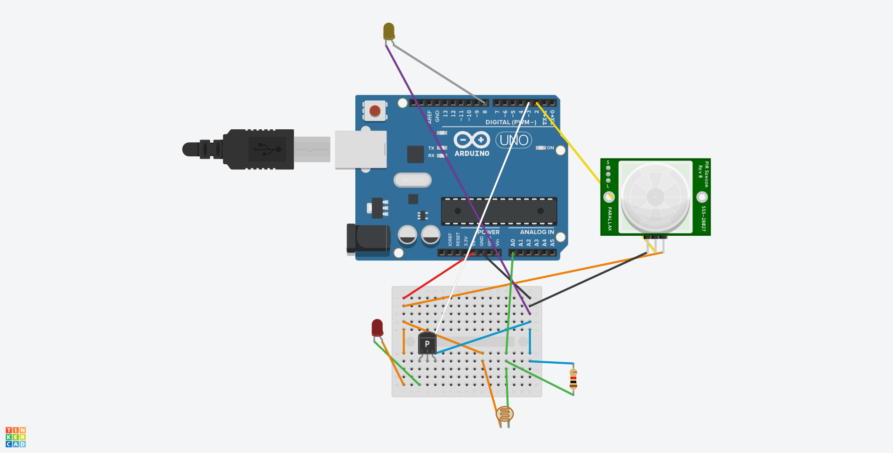
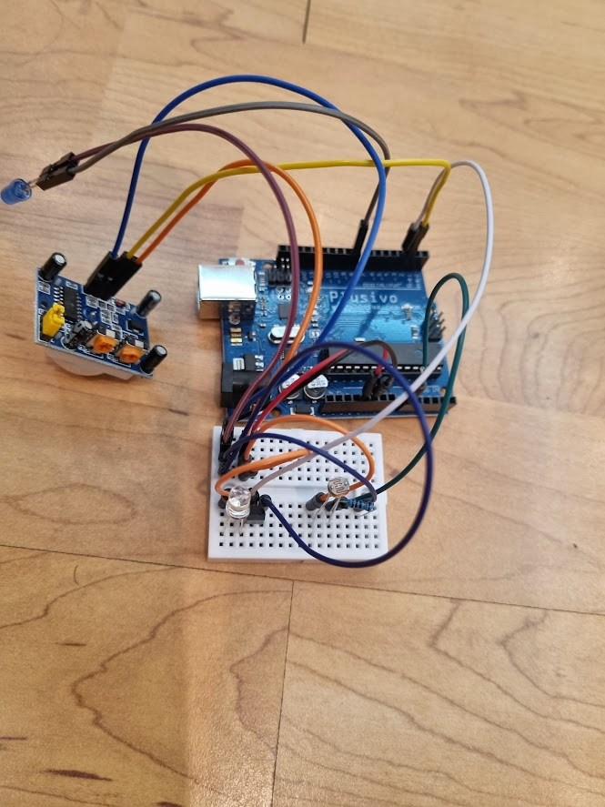
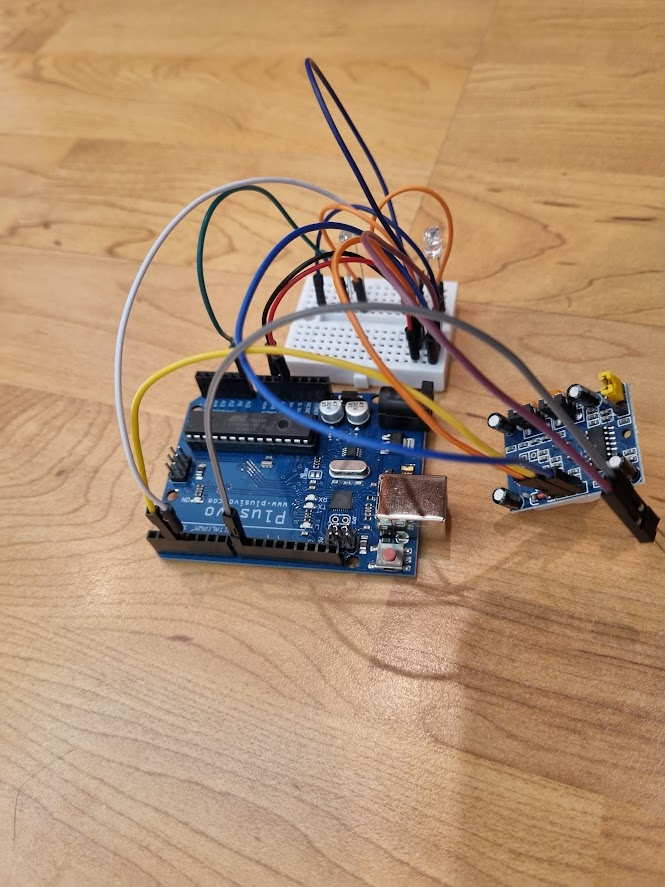
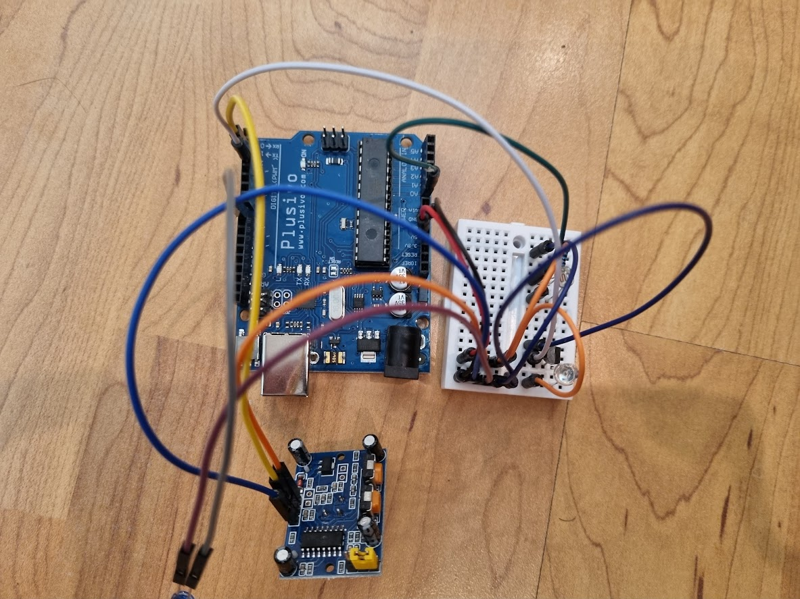
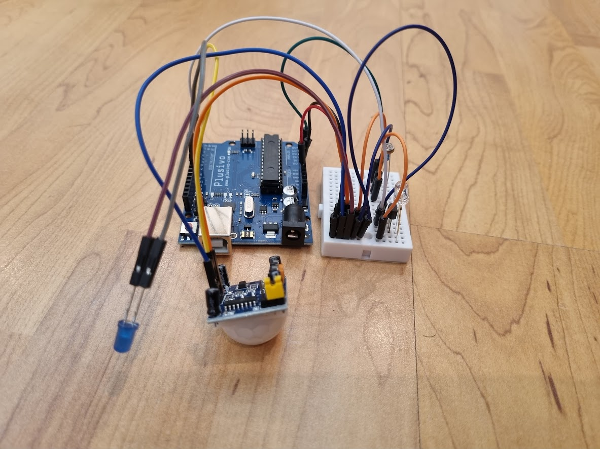
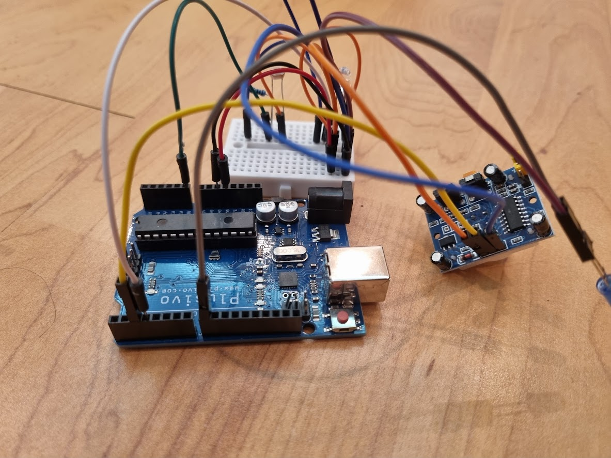
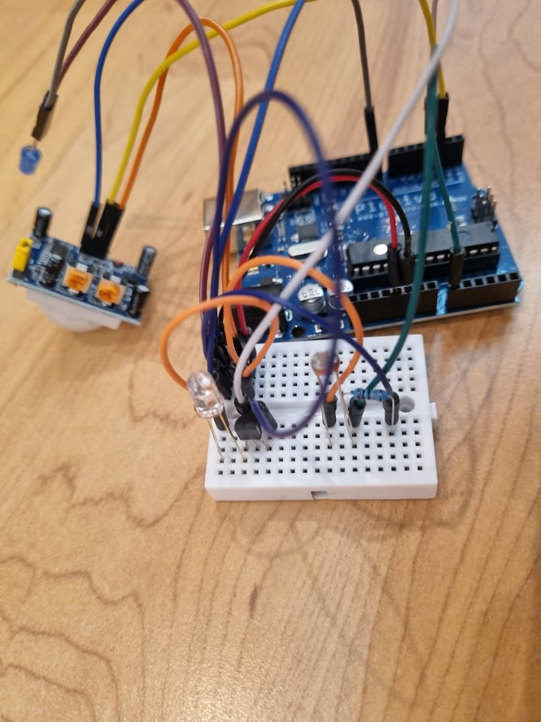
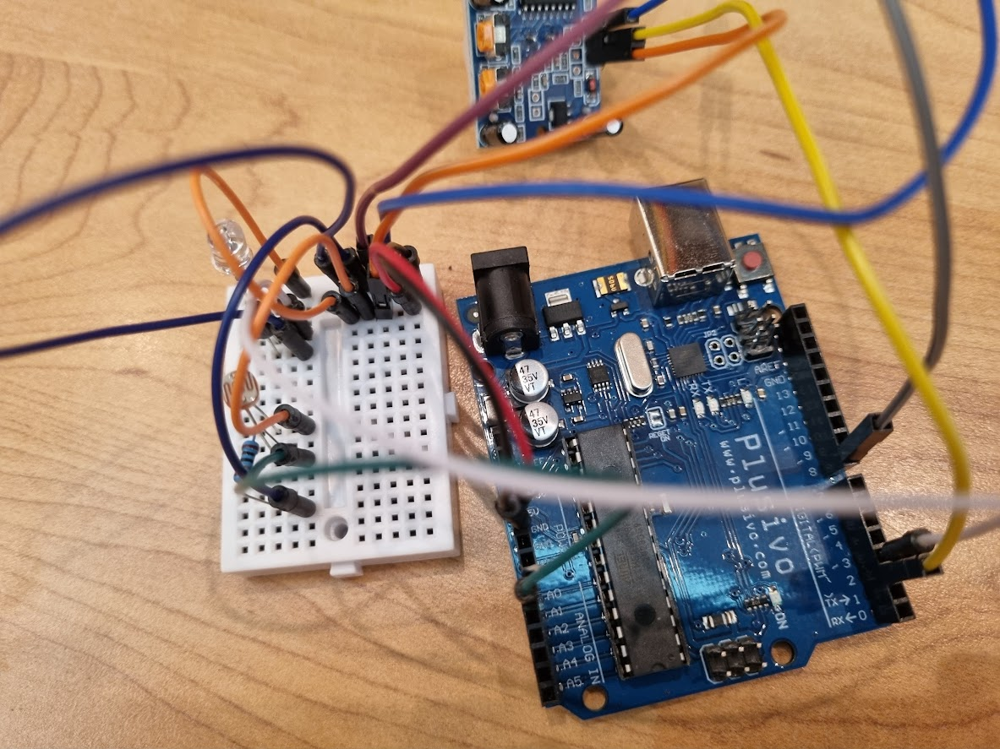
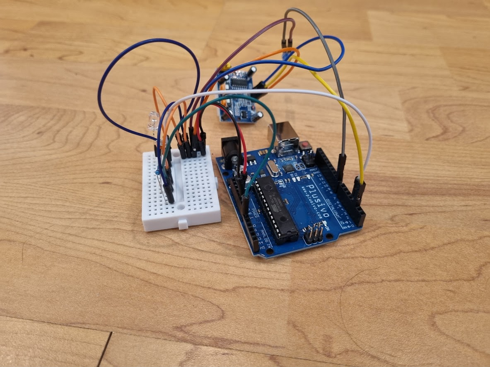
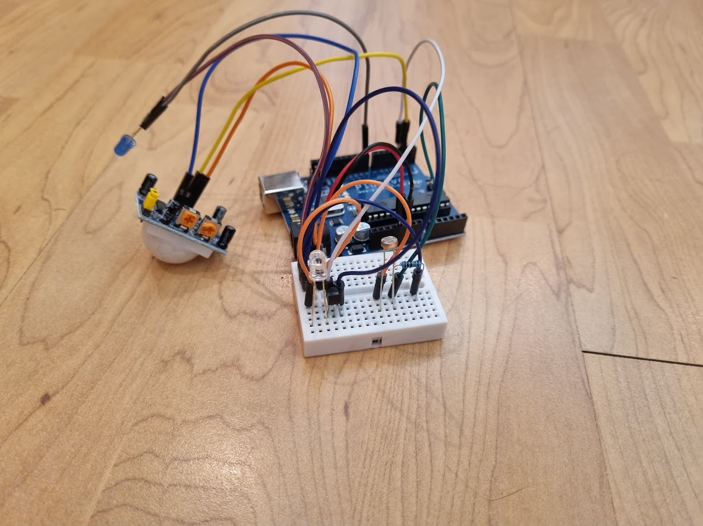

Code, reference pictures, CAD files for the IR controller featured here:

[Building an energy saving AC controller with 0 prior knowledge.](https://robsware.github.io/2022/06/12/accontroller)

The logic tree is:

```text
If it's daylight:
    Check for movement:
        If no movement, start loop for 30 minutes:
            If movement is detected in those 30 minutes, reset loop:
                If no movement in 30 minutes, send AC turn off signal
```

The code is configured to run every 10 seconds instead of 30 minutes for demo purposes.    

Wiring:


Reference pictures:









